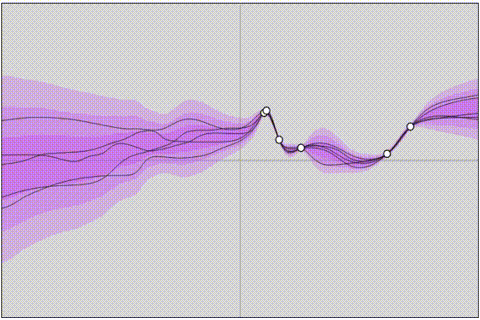
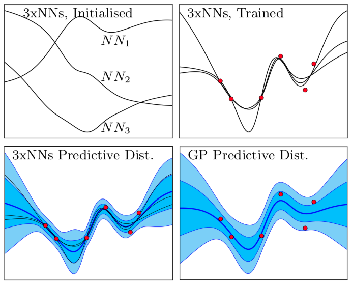

# Uncertainty in Neural Networks: Bayesian Ensembling
Code from paper 'Uncertainty in Neural Networks: Bayesian Ensembling': https://arxiv.org/abs/1810.05546

Play with the [interactive demo here](https://htmlpreview.github.io/?https://github.com/TeaPearce/Bayesian_NN_Ensembles/blob/master/html_demos/demos/bayes_ens_demo_01.html).

  

[notebook_examples](notebook_examples) provides lightweight demo code for a Bayesian anchored ensemble.

[FULL EXPERIMENTAL CODE AND MORE DEMOS TO BE UPLOADED SOON]

For queries, email me at tp424 [at] cam.ac.uk.

### Trimmed Down Code

Folder [03_trimmed_down](03_trimmed_down) provides a carved out piece of code from the full experimental code (still to be uploaded).

- [script_methods.py](03_trimmed_down/script_methods.py) - main program, run this file to produce some graphs
- [DataGen.py](03_trimmed_down/DataGen.py) - handles data set generation or read in
- [utils.py](03_trimmed_down/utils.py) - handles some plotting and support functions
- [module_gp.py](03_trimmed_down/module_gp.py) - code behind the equivalent gaussian processes
- [module_NN_ens.py](03_trimmed_down/module_NN_ens.py) - where the magic happens! - includes the regularisation around initialisation values (the ‘anchor’ method, line 155). Is only set up for single or double layer fully connected NN.

Other thoughts:
- Does NOT include modules for the other methods, such as variational inference and HMC
- I’m not sure how robust the code will be to deviations from the specific versions of packages (I had conflict issues between Tensorflow and Edward) and python (3.6) I used, so may require some tweaking depending on what you’re running
- code in module_NN_ens.py (and more generally everywhere) is much more complex than needed - I added a lot of extra functionality during development and testing, trying things out which aren’t necessarily needed in the final version.
- Hopefully variable names etc should be obvious enough, parameters I think you’ll want to vary are mainly controlled in the inputs section in script_methods.py

